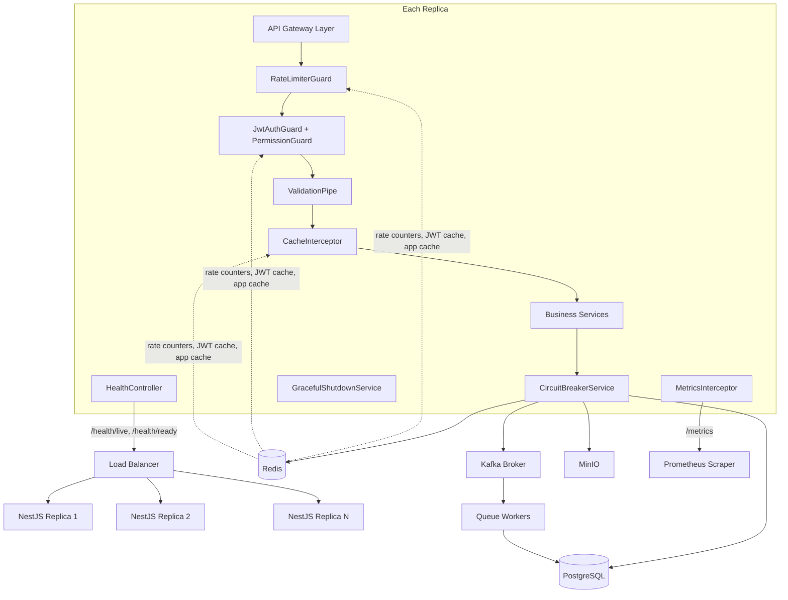

# Design Document: High-Load Scaling System

## Overview

This design describes the architectural additions and modifications required to make the existing NestJS ERP backend sustain high concurrent load across multiple tenants. The approach is additive — existing modules (PostgreSQL/TypeORM, Redis, Kafka, MinIO, Docker) are extended rather than replaced.

The system must handle 300+ concurrent virtual users with p95 latency below 500ms on read endpoints, sub-1% error rates, and full security enforcement at all throughput levels. Six cross-cutting concerns drive the design: rate limiting, caching, connection pooling, async offloading, circuit breaking, and observability. Horizontal scalability and graceful shutdown are first-class requirements.

### Key Design Decisions

- **Redis as the single source of shared state**: All rate limit counters, distributed locks, and JWT claim caches live in Redis so that any replica can serve any request without session affinity.
- **`@nestjs/throttler` with a custom Redis storage adapter** for rate limiting, replacing any in-memory throttler.
- **`@nestjs/cache-manager` with `cache-manager-ioredis-yet`** (already in `package.json`) for cache-aside logic.
- **`@nestjs/terminus`** for health probes — lightweight, integrates with TypeORM and Redis out of the box.
- **`nestjs-otel` / `prom-client`** for Prometheus metrics exposure.
- **`cockatiel`** for circuit breakers — a well-maintained, TypeScript-native resilience library.
- **`fast-check`** as the property-based testing library (TypeScript-native, works with Jest).

---

## Architecture



### Request Lifecycle

1. Load balancer routes request to any available replica.
2. `RateLimiterGuard` checks per-tenant and per-IP counters in Redis (atomic `INCR`/`EXPIRE`).
3. `JwtAuthGuard` validates the JWT — checks Redis cache first, falls back to cryptographic verification.
4. `PermissionGuard` enforces tenant isolation and RBAC.
5. `ValidationPipe` strips unknown fields and validates the DTO.
6. `CacheInterceptor` returns cached response on hit; on miss, proceeds to service layer.
7. Business service calls downstream dependencies through `CircuitBreakerService`.
8. `MetricsInterceptor` records request duration and outcome.
9. On write operations, cache invalidation is triggered before the response is returned.

---

## Components and Interfaces

### 1. RateLimiterModule

Wraps `@nestjs/throttler` with a custom `ThrottlerStorageRedisService` that uses the existing `RedisService`. Two throttle tiers are applied globally: per-tenant (1000 req/min) and per-IP (300 req/min).

```typescript
// src/core/rate-limiter/throttler-redis.storage.ts
export class ThrottlerStorageRedisService implements ThrottlerStorage {
  async increment(key: string, ttl: number): Promise<ThrottlerStorageRecord>;
}

// src/core/rate-limiter/rate-limiter.module.ts
@Module({
  imports: [
    ThrottlerModule.forRootAsync({
      inject: [ConfigService, RedisService],
      useFactory: (config, redis) => ({
        throttlers: [
          { name: 'tenant', ttl: 60_000, limit: config.get('RATE_LIMIT_TENANT', 1000) },
          { name: 'ip',     ttl: 60_000, limit: config.get('RATE_LIMIT_IP', 300) },
        ],
        storage: new ThrottlerStorageRedisService(redis),
      }),
    }),
  ],
})
export class RateLimiterModule {}
```

The `ThrottlerStorageRedisService.increment` implementation uses `MULTI`/`EXEC` to atomically `INCR` the counter and set `EXPIRE` only on first creation, ensuring consistent cross-replica enforcement.

Key format: `throttle:{tier}:{tenantId|ip}` — tenant ID extracted from the JWT claim via a custom `ThrottlerGuard` subclass.

On limit breach, the guard throws `ThrottlerException` which the global exception filter maps to HTTP 429 with a `Retry-After` header computed from the remaining TTL.

### 2. CacheModule (enhanced)

The existing `RedisService.cached()` helper is already in place. This design formalizes it into a `CacheInterceptor` and a `@Cacheable` / `@CacheEvict` decorator pair.

```typescript
// src/core/cache/cache.interceptor.ts
@Injectable()
export class HttpCacheInterceptor implements NestInterceptor {
  intercept(context: ExecutionContext, next: CallHandler): Observable<unknown>;
  private buildKey(req: Request, tenantId: string): string;
  // key format: cache:{tenantId}:{resource}:{queryHash}
}

// src/core/cache/cache.decorators.ts
export function Cacheable(resource: string, ttl?: number): MethodDecorator;
export function CacheEvict(resource: string): MethodDecorator;
```

Cache key format: `cache:{tenantId}:{resource}:{queryHash}` — tenant namespace is mandatory, preventing cross-tenant leakage.

TTL defaults: 300s for list endpoints, 60s for single-entity endpoints. Both are overridable via `@Cacheable('products', 120)`.

On write (POST/PUT/PATCH/DELETE), `CacheEvict` calls `RedisService.delPattern('cache:{tenantId}:{resource}:*')` before returning the response.

### 3. CircuitBreakerService

Wraps all external dependency calls (PostgreSQL via TypeORM, Redis, Kafka, MinIO) with `cockatiel` circuit breakers. Each dependency gets an independent `CircuitBreakerPolicy`.

```typescript
// src/core/circuit-breaker/circuit-breaker.service.ts
@Injectable()
export class CircuitBreakerService {
  private readonly breakers = new Map<string, CircuitBreakerPolicy>();

  getBreaker(dependency: 'postgres' | 'redis' | 'kafka' | 'minio'): CircuitBreakerPolicy;

  async execute<T>(
    dependency: 'postgres' | 'redis' | 'kafka' | 'minio',
    fn: () => Promise<T>,
    fallback?: () => T,
  ): Promise<T>;
}
```

Configuration per breaker:
- Half-open after: 30s (configurable via `CIRCUIT_BREAKER_RESET_TIMEOUT`)
- Open threshold: 50% failure rate over 10s sliding window
- Fallback response returned within 50ms when open

### 4. HealthModule

Uses `@nestjs/terminus` to expose `/health/live` and `/health/ready`.

```typescript
// src/core/health/health.controller.ts
@Controller('health')
export class HealthController {
  @Get('live')
  liveness(): HealthCheckResult;

  @Get('ready')
  readiness(): Promise<HealthCheckResult>;
}
```

`/health/live` — returns 200 if the process is running (no dependency checks).
`/health/ready` — checks TypeORM connection and Redis ping. Returns 503 with a JSON body naming the failing dependency if either is unreachable.

Both endpoints are excluded from `JwtAuthGuard` and `RateLimiterGuard` via `@Public()` decorator.

On SIGTERM, `GracefulShutdownService` sets a flag that causes `/health/ready` to immediately return 503.

### 5. MetricsModule

Uses `prom-client` to expose a `/metrics` endpoint in Prometheus text format.

```typescript
// src/core/metrics/metrics.service.ts
@Injectable()
export class MetricsService {
  readonly requestCounter: Counter;
  readonly requestDuration: Histogram;   // buckets: 50, 100, 250, 500, 1000, 2500ms
  readonly errorCounter: Counter;
  readonly cacheHits: Counter;
  readonly cacheMisses: Counter;
  readonly dbConnectionsActive: Gauge;
  readonly dbConnectionsIdle: Gauge;
  readonly dbConnectionsWaiting: Gauge;

  getMetrics(): Promise<string>;
}

// src/core/metrics/metrics.interceptor.ts
@Injectable()
export class MetricsInterceptor implements NestInterceptor {
  intercept(context: ExecutionContext, next: CallHandler): Observable<unknown>;
}
```

`/metrics` is excluded from auth and rate limiting. DB connection gauges are updated on a 10-second interval via a `@Cron` job in `MetricsService`.

### 6. GracefulShutdownService

```typescript
// src/core/shutdown/graceful-shutdown.service.ts
@Injectable()
export class GracefulShutdownService implements OnApplicationShutdown {
  private shuttingDown = false;
  private readonly drainTimeout: number; // default 30s

  isShuttingDown(): boolean;

  async onApplicationShutdown(signal: string): Promise<void>;
  // 1. Set shuttingDown = true (health/ready → 503)
  // 2. Log INFO "Graceful shutdown initiated"
  // 3. Wait for in-flight requests to drain (up to drainTimeout)
  // 4. Disconnect Kafka consumer
  // 5. Log INFO "Graceful shutdown complete"
  // 6. process.exit(0)
}
```

`main.ts` is updated to call `app.enableShutdownHooks()` (already present) and to configure the HTTP server's `keepAliveTimeout` and `headersTimeout` to be less than the load balancer's idle timeout.

### 7. AuditLoggerService

```typescript
// src/core/audit/audit-logger.service.ts
@Injectable()
export class AuditLoggerService {
  async log(event: AuditEvent): Promise<void>;
  // Publishes to KAFKA_TOPICS.AUDIT_LOGS within 500ms
  // Falls back to structured console log if Kafka is unavailable
}

interface AuditEvent {
  timestamp: string;       // ISO 8601
  tenantId: string | null;
  userId: string | null;
  sourceIp: string;
  eventType: 'auth_failure' | 'authz_failure' | 'rate_limit_violation';
  details: Record<string, unknown>;
}
```

`JwtAuthGuard`, `PermissionGuard`, and the throttler guard each inject `AuditLoggerService` and call `log()` on failure.

### 8. LoggingInterceptor (enhanced)

The existing `GlobalExceptionFilter` is extended and a new `LoggingInterceptor` is added to emit structured JSON for every request:

```typescript
interface RequestLog {
  timestamp: string;
  method: string;
  path: string;
  tenantId: string | null;
  statusCode: number;
  durationMs: number;
  slow?: true;   // present when durationMs > 1000
}
```

---

## Data Models

### Rate Limit Counter (Redis)

```
Key:   throttle:{tier}:{identifier}
       tier        = "tenant" | "ip"
       identifier  = tenantId (UUID) | IP address
Value: integer (request count)
TTL:   window duration in seconds (default 60)
```

### Cache Entry (Redis)

```
Key:   cache:{tenantId}:{resource}:{queryHash}
       tenantId    = UUID
       resource    = e.g. "products", "users"
       queryHash   = SHA-256 of serialized query params (hex, first 16 chars)
Value: JSON-serialized response body
TTL:   300s (list) | 60s (single entity) | configurable per resource
```

### JWT Claims Cache (Redis)

```
Key:   jwt:claims:{tokenSignatureHash}
       tokenSignatureHash = base64url of JWT signature bytes
Value: JSON-serialized JWT payload (claims)
TTL:   token's remaining validity in seconds (exp - now)
```

### Audit Event (Kafka message)

```
Topic:   erp.audit.logs
Key:     tenantId (or "system" if null)
Value:   JSON AuditEvent (see AuditLoggerService interface above)
```

### Circuit Breaker State (in-process)

```
Map<dependency, CircuitBreakerPolicy>
  dependency: "postgres" | "redis" | "kafka" | "minio"
  state:      CLOSED | OPEN | HALF_OPEN
  failureRate: sliding window (10s)
  resetTimeout: 30s (configurable)
```

### Connection Pool Configuration (TypeORM)

```typescript
{
  extra: {
    max: process.env.DB_POOL_MAX ?? 20,
    min: process.env.DB_POOL_MIN ?? 5,
    idleTimeoutMillis: 30_000,
    connectionTimeoutMillis: process.env.DB_POOL_TIMEOUT_MS ?? 10_000,
  }
}
```

---

## Correctness Properties

*A property is a characteristic or behavior that should hold true across all valid executions of a system — essentially, a formal statement about what the system should do. Properties serve as the bridge between human-readable specifications and machine-verifiable correctness guarantees.*

### Property 1: Rate limit counter enforcement

*For any* tenant ID or IP address, after the configured request limit is reached within the time window, all subsequent requests within that window must be rejected with HTTP 429 and a `Retry-After` header.

**Validates: Requirements 1.1, 1.2, 1.3**

### Property 2: Rate limit state lives in Redis

*For any* request processed by the rate limiter, a corresponding counter key must exist in Redis with a TTL set to the configured window duration, and the counter value must equal the number of requests made within the current window.

**Validates: Requirements 1.4, 1.5, 6.3**

### Property 3: Cache round-trip equivalence

*For any* cacheable resource and tenant, fetching the resource, invalidating the cache, and re-fetching must return a result equivalent to a direct database query — the cache must never serve stale data after invalidation.

**Validates: Requirements 2.1, 2.2, 2.6**

### Property 4: Cache invalidation on write

*For any* write operation on a resource, all cache keys scoped to the affected tenant and resource type must be absent from Redis immediately after the write completes.

**Validates: Requirements 2.3**

### Property 5: Tenant-namespaced cache keys

*For any* two tenants A and B, no cache key generated for tenant A must be retrievable using tenant B's namespace — all cache keys must contain the tenant ID as a mandatory prefix segment.

**Validates: Requirements 2.4**

### Property 6: Connection pool bounds invariant

*For any* load scenario, the number of active PostgreSQL connections must never exceed the configured maximum (`DB_POOL_MAX`) and the pool must maintain at least the configured minimum idle connections (`DB_POOL_MIN`) when the application is idle.

**Validates: Requirements 3.1, 3.2**

### Property 7: Async fire-and-forget returns immediately

*For any* operation classified as asynchronous, the HTTP response must be returned to the caller before the corresponding Kafka message is fully processed by a consumer — the handler must not block on Kafka processing completion.

**Validates: Requirements 4.1**

### Property 8: Exactly-once message processing

*For any* Kafka message delivered to a consumer group, the message must be processed exactly once — duplicate deliveries (same topic + partition + offset) must be detected via the Redis idempotency key and skipped.

**Validates: Requirements 4.2**

### Property 9: Worker concurrency limit

*For any* burst of messages, the number of messages being processed concurrently by a single Queue_Worker instance must never exceed the configured parallelism limit (`KAFKA_CONSUMER_CONCURRENCY`, default 10).

**Validates: Requirements 4.4**

### Property 10: Circuit breaker independence

*For any* two external dependencies A and B, opening the circuit for dependency A must not affect the circuit state of dependency B — each dependency's failure rate is tracked independently.

**Validates: Requirements 5.1**

### Property 11: Circuit opens at failure threshold

*For any* external dependency, when the failure rate within the 10-second sliding window exceeds 50%, the circuit must transition to OPEN state and subsequent calls must return the fallback response without contacting the dependency.

**Validates: Requirements 5.2, 5.3**

### Property 12: Circuit breaker state machine round-trip

*For any* external dependency in OPEN state, after the reset timeout elapses the circuit must transition to HALF_OPEN; a successful probe must close the circuit; a failed probe must return the circuit to OPEN with the timer reset.

**Validates: Requirements 5.4, 5.5, 5.6**

### Property 13: Health readiness reflects dependency state

*For any* combination of dependency availability states, the `/health/ready` endpoint must return HTTP 200 if and only if all critical dependencies (PostgreSQL, Redis) are reachable; otherwise it must return HTTP 503 with a JSON body that names every failing dependency.

**Validates: Requirements 7.2, 7.3**

### Property 14: Health probe response time

*For any* system load level, both `/health/live` and `/health/ready` must respond within 200ms.

**Validates: Requirements 7.4**

### Property 15: JWT validation enforcement

*For any* protected route, a request without a valid JWT must be rejected with HTTP 401, and the rejection must occur within 50ms regardless of current system load.

**Validates: Requirements 8.1, 8.5**

### Property 16: JWT claims cache round-trip

*For any* valid JWT, after the first successful validation the claims must be cached in Redis with a TTL equal to the token's remaining validity; after the token is revoked the cache entry must be absent.

**Validates: Requirements 8.2, 8.3**

### Property 17: Tenant isolation enforcement

*For any* user authenticated under tenant A, all requests attempting to access resources belonging to tenant B must be rejected with HTTP 403.

**Validates: Requirements 8.4**

### Property 18: Audit event publication

*For any* authentication failure, authorization failure, or rate limit violation, a corresponding audit event must be published to the `erp.audit.logs` Kafka topic within 500ms of the triggering event, containing the timestamp, tenant ID, user ID (if available), and source IP.

**Validates: Requirements 8.6, 10.4**

### Property 19: Input validation rejection

*For any* request payload that fails DTO schema validation (including fields exceeding maximum length), the API must return HTTP 400 with a structured error body listing all validation failures, and the payload must not reach the service layer.

**Validates: Requirements 9.1, 9.5**

### Property 20: Whitelist stripping

*For any* request payload containing properties not declared in the DTO schema, those extra properties must be absent from the object received by the service handler.

**Validates: Requirements 9.2**

### Property 21: Structured request logging

*For any* HTTP request processed by the API, a structured JSON log entry must be emitted containing at minimum: timestamp, HTTP method, path, tenant ID, response status code, and response duration in milliseconds.

**Validates: Requirements 10.2**

### Property 22: Graceful HTTP drain

*For any* in-flight HTTP request that was accepted before SIGTERM, the request must be allowed to complete and receive a response before the process exits, up to the configured drain timeout.

**Validates: Requirements 11.1**

### Property 23: Graceful Kafka worker drain

*For any* Kafka message batch being processed at the time SIGTERM is received, all messages in the current batch must be fully processed before the consumer disconnects from Kafka.

**Validates: Requirements 11.3**

---

## Error Handling

### Rate Limiter Errors

- Redis unavailable: fail open (allow the request) and log a warning. Rate limiting is a best-effort protection; availability takes priority.
- Counter increment failure: same as above — allow the request, log warning.

### Cache Errors

- Redis read failure: treat as cache miss, proceed to database. Cache errors are non-fatal.
- Redis write failure: log warning, return the result to the caller without caching. The `RedisService` already swallows write errors.
- Cache invalidation failure: log error, continue. Stale data is preferable to a failed write response.

### Circuit Breaker Errors

- When a circuit is OPEN, `CircuitBreakerService.execute()` calls the provided `fallback` function. If no fallback is provided, it throws `ServiceUnavailableException` (HTTP 503).
- Circuit breaker state is in-process only — no distributed circuit state. Each replica maintains its own breakers. This is acceptable because each replica independently observes the same downstream failures.

### Database Errors

- Connection timeout (pool exhausted): TypeORM throws `QueryFailedError`. The global exception filter maps this to HTTP 503 with a generic message.
- Query errors: mapped to HTTP 500 by the global exception filter. Sensitive details are not exposed to the client.

### Kafka Errors

- Producer unavailable: `KafkaService.publish()` is already fire-and-forget and never throws. Async operations degrade gracefully.
- Consumer failure: after 3 retries, the message is published to the dead-letter topic (`erp.dlq.{original_topic}`) and a `WARN` log is emitted.

### Validation Errors

- `ValidationPipe` with `whitelist: true` and `forbidNonWhitelisted: true` is already configured in `main.ts`. It throws `BadRequestException` with the full list of constraint violations, which the global exception filter serializes to the structured 400 response.

### Health Check Errors

- If a health indicator throws unexpectedly, `@nestjs/terminus` catches it and returns 503. The error is logged at ERROR level.

### Graceful Shutdown Errors

- If the drain timeout expires with in-flight requests still open, the server is forcibly closed and the process exits with code 0. Any incomplete requests receive a connection reset.

---

## Testing Strategy

### Dual Testing Approach

Both unit/integration tests and property-based tests are required. They are complementary:

- **Unit/integration tests** cover specific examples, integration points, and error conditions.
- **Property-based tests** verify universal invariants across randomly generated inputs.

### Property-Based Testing Library

**`fast-check`** — TypeScript-native, works directly with Jest, no additional test runner required.

Install: `npm install --save-dev fast-check`

Each property-based test must run a minimum of **100 iterations** (fast-check default is 100; increase with `{ numRuns: 200 }` for critical properties).

Each test must include a comment referencing the design property:
```typescript
// Feature: high-load-scaling-system, Property 1: Rate limit counter enforcement
```

### Property Test Implementations

Each correctness property maps to exactly one property-based test:

| Property | Test file | Arbitraries |
|---|---|---|
| P1: Rate limit enforcement | `rate-limiter.spec.ts` | `fc.uuid()` (tenantId), `fc.ipV4()` (IP), `fc.integer({min:1, max:2000})` (request count) |
| P2: Rate limit state in Redis | `rate-limiter.spec.ts` | `fc.uuid()`, `fc.integer({min:1, max:100})` |
| P3: Cache round-trip equivalence | `cache.interceptor.spec.ts` | `fc.uuid()` (tenantId), `fc.string()` (resource), `fc.anything()` (payload) |
| P4: Cache invalidation on write | `cache.interceptor.spec.ts` | `fc.uuid()`, `fc.string()` |
| P5: Tenant-namespaced cache keys | `cache.interceptor.spec.ts` | `fc.uuid()`, `fc.uuid()` (two distinct tenants) |
| P6: Connection pool bounds | `database.spec.ts` | `fc.integer({min:1, max:50})` (concurrent queries) |
| P7: Async fire-and-forget | `kafka.service.spec.ts` | `fc.string()` (topic), `fc.anything()` (payload) |
| P8: Exactly-once processing | `kafka-consumer.spec.ts` | `fc.string()` (offset), `fc.integer()` (partition) |
| P9: Worker concurrency limit | `kafka-consumer.spec.ts` | `fc.integer({min:1, max:50})` (message burst size) |
| P10: Circuit breaker independence | `circuit-breaker.spec.ts` | `fc.constantFrom('postgres','redis','kafka','minio')` × 2 |
| P11: Circuit opens at threshold | `circuit-breaker.spec.ts` | `fc.integer({min:0, max:100})` (failure count), `fc.integer({min:1, max:100})` (total) |
| P12: Circuit state machine round-trip | `circuit-breaker.spec.ts` | `fc.boolean()` (probe result) |
| P13: Health readiness reflects deps | `health.controller.spec.ts` | `fc.boolean()` (postgres up), `fc.boolean()` (redis up) |
| P14: Health probe response time | `health.controller.spec.ts` | `fc.integer({min:0, max:1000})` (simulated load) |
| P15: JWT validation enforcement | `jwt-auth.guard.spec.ts` | `fc.string()` (invalid token), `fc.string()` (route) |
| P16: JWT claims cache round-trip | `jwt-auth.guard.spec.ts` | `fc.record({sub: fc.uuid(), tenantId: fc.uuid(), exp: fc.integer()})` |
| P17: Tenant isolation enforcement | `permission.guard.spec.ts` | `fc.uuid()` (tenantA), `fc.uuid()` (tenantB) |
| P18: Audit event publication | `audit-logger.spec.ts` | `fc.constantFrom('auth_failure','authz_failure','rate_limit_violation')`, `fc.ipV4()` |
| P19: Input validation rejection | `validation.spec.ts` | `fc.anything()` (invalid payloads), `fc.string({maxLength: 10000})` (oversized fields) |
| P20: Whitelist stripping | `validation.spec.ts` | `fc.dictionary(fc.string(), fc.anything())` (extra fields) |
| P21: Structured request logging | `logging.interceptor.spec.ts` | `fc.string()` (method), `fc.string()` (path), `fc.uuid()` (tenantId) |
| P22: Graceful HTTP drain | `graceful-shutdown.spec.ts` | `fc.integer({min:1, max:10})` (in-flight count), `fc.integer({min:100, max:5000})` (request duration ms) |
| P23: Graceful Kafka drain | `graceful-shutdown.spec.ts` | `fc.integer({min:1, max:10})` (batch size) |

### Unit / Integration Tests

Focus on:
- Specific examples: valid JWT accepted, invalid JWT rejected, 429 response shape, health endpoint JSON body format
- Edge cases: empty cache, pool exhaustion timeout, Kafka broker down, SIGTERM during active request
- Integration: `RateLimiterGuard` + `RedisService` wired together, `HealthController` + `TypeOrmHealthIndicator`

### Load Tests (k6)

The existing k6 test suite in `backend/k6-tests/` covers the performance baselines from Requirement 12. These are not unit/property tests and are run separately against a live environment.

### Test Configuration

```typescript
// jest.config additions for property tests
// fast-check seed can be fixed for CI reproducibility:
// fc.configureGlobal({ seed: 42, numRuns: 100 });
```
