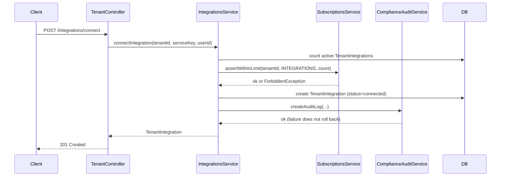
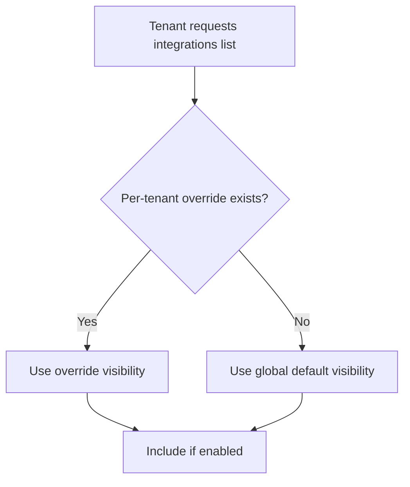

# Design Document: Tenant Integrations Management

## Overview

This feature extends the existing NestJS backend with a dedicated `integrations` module that handles the full lifecycle of tenant integration management. It introduces:

- A new `IntegrationsModule` with two controller surfaces: one for tenant-scoped operations and one for platform admin operations
- Two new database entities: `IntegrationServiceEntity` (the catalog) and `TenantIntegrationEntity` (per-tenant connections)
- A `TenantIntegrationVisibilityEntity` for per-tenant visibility overrides
- Integration with the existing `ComplianceAuditService` for immutable audit logging
- Integration with the existing `SubscriptionsService.assertWithinLimit` using `PlanLimitKey.INTEGRATIONS`

`PlanLimitKey.INTEGRATIONS` already exists in `subscription.constants.ts` and is seeded into all default plan definitions, so no changes to the subscriptions module are required.

---

## Architecture

The feature is implemented as a single new NestJS module: `backend/src/modules/integrations/`.

```
integrations/
  entities/
    integration-service.entity.ts       # Catalog entry (global)
    tenant-integration.entity.ts        # Per-tenant connection record
    tenant-integration-visibility.entity.ts  # Per-tenant visibility override
  dto/
    create-integration-service.dto.ts
    update-integration-service.dto.ts
    connect-integration.dto.ts
    query-audit-log.dto.ts
    visibility-override.dto.ts
  integrations-tenant.controller.ts     # Tenant-scoped endpoints
  integrations-platform.controller.ts   # Platform admin endpoints
  integrations.service.ts               # Core business logic
  integrations.module.ts
```

The module imports `ComplianceAuditModule` and `SubscriptionsModule` to consume their exported services.

### Request Flow



### Visibility Resolution



---

## Components and Interfaces

### IntegrationsService

Core service injected into both controllers.

```typescript
class IntegrationsService {
  // Tenant operations
  listVisibleIntegrations(tenantId: string): Promise<IntegrationServiceEntity[]>
  connectIntegration(tenantId: string, serviceKey: string, userId: string, actorRole: string): Promise<TenantIntegrationEntity>
  disconnectIntegration(tenantId: string, integrationId: string, userId: string, actorRole: string): Promise<TenantIntegrationEntity>

  // Platform admin — catalog
  createService(dto: CreateIntegrationServiceDto): Promise<IntegrationServiceEntity>
  updateService(id: string, dto: UpdateIntegrationServiceDto): Promise<IntegrationServiceEntity>
  deleteService(id: string): Promise<void>
  listServices(page: number, limit: number, category?: string, search?: string): Promise<PaginatedResult<IntegrationServiceEntity>>

  // Platform admin — visibility
  setGlobalVisibility(serviceId: string, enabled: boolean): Promise<IntegrationServiceEntity>
  setTenantVisibilityOverride(tenantId: string, serviceId: string, enabled: boolean): Promise<TenantIntegrationVisibilityEntity>

  // Platform admin — tenant management (no limit enforcement)
  connectIntegrationForTenant(tenantId: string, serviceKey: string, actorUserId: string): Promise<TenantIntegrationEntity>
  disconnectIntegrationForTenant(tenantId: string, integrationId: string, actorUserId: string): Promise<TenantIntegrationEntity>

  // Audit log query
  queryAuditLogs(query: QueryAuditLogDto): Promise<AuditLogEntity[]>

  // Internal
  private resolveVisibility(tenantId: string, service: IntegrationServiceEntity): boolean
  private writeAuditLog(params: AuditLogParams): Promise<void>
  private countActiveIntegrations(tenantId: string): Promise<number>
}
```

### IntegrationsTenantController

Base path: `/integrations`  
Guards: `JwtAuthGuard`, `TenantInterceptor`

| Method | Path | Permission | Description |
|--------|------|-----------|-------------|
| GET | `/` | `integrations:read` | List visible integrations for tenant |
| POST | `/connect` | `integrations:manage` | Connect an integration |
| PATCH | `/:id/disconnect` | `integrations:manage` | Disconnect an integration |

### IntegrationsPlatformController

Base path: `/platform/integrations`  
Guards: `JwtAuthGuard`, `SystemAdminGuard`

| Method | Path | Description |
|--------|------|-------------|
| GET | `/catalog` | List all catalog services (paginated, filterable) |
| POST | `/catalog` | Create a new Integration_Service |
| PATCH | `/catalog/:id` | Update an Integration_Service |
| DELETE | `/catalog/:id` | Delete an Integration_Service |
| PATCH | `/catalog/:id/visibility` | Set global default visibility |
| PATCH | `/catalog/:id/visibility/:tenantId` | Set per-tenant visibility override |
| GET | `/tenants/:tenantId/integrations` | List tenant's integrations |
| POST | `/tenants/:tenantId/integrations/connect` | Connect on behalf of tenant |
| PATCH | `/tenants/:tenantId/integrations/:id/disconnect` | Disconnect on behalf of tenant |
| GET | `/audit-logs` | Query audit logs across tenants |

---

## Data Models

### IntegrationServiceEntity

```typescript
@Entity('integration_services')
export class IntegrationServiceEntity {
  @PrimaryGeneratedColumn('uuid')
  id: string;

  @Column({ unique: true, length: 100 })
  key: string;           // slug, e.g. 'slack', 'stripe'

  @Column({ length: 200 })
  name: string;

  @Column({ length: 100 })
  category: string;

  @Column()
  logoUrl: string;

  @Column({ default: true })
  globalVisibilityEnabled: boolean;

  @Column({ type: 'text', nullable: true })
  description: string | null;

  @CreateDateColumn()
  createdAt: Date;

  @UpdateDateColumn()
  updatedAt: Date;
}
```

### TenantIntegrationEntity

```typescript
export enum TenantIntegrationStatus {
  CONNECTED = 'connected',
  DISCONNECTED = 'disconnected',
}

@Entity('tenant_integrations')
export class TenantIntegrationEntity {
  @PrimaryGeneratedColumn('uuid')
  id: string;

  @Column({ type: 'uuid' })
  tenantId: string;

  @Column({ type: 'uuid' })
  serviceId: string;

  @ManyToOne(() => IntegrationServiceEntity)
  @JoinColumn({ name: 'serviceId' })
  service: IntegrationServiceEntity;

  @Column({ type: 'enum', enum: TenantIntegrationStatus, default: TenantIntegrationStatus.CONNECTED })
  status: TenantIntegrationStatus;

  @Column({ type: 'uuid', nullable: true })
  connectedByUserId: string | null;

  @CreateDateColumn()
  connectedAt: Date;

  @UpdateDateColumn()
  updatedAt: Date;
}
```

### TenantIntegrationVisibilityEntity

```typescript
@Entity('tenant_integration_visibility')
@Unique(['tenantId', 'serviceId'])
export class TenantIntegrationVisibilityEntity {
  @PrimaryGeneratedColumn('uuid')
  id: string;

  @Column({ type: 'uuid' })
  tenantId: string;

  @Column({ type: 'uuid' })
  serviceId: string;

  @ManyToOne(() => IntegrationServiceEntity)
  @JoinColumn({ name: 'serviceId' })
  service: IntegrationServiceEntity;

  @Column()
  enabled: boolean;

  @UpdateDateColumn()
  updatedAt: Date;
}
```

### Audit Log Usage

Audit entries are written via `ComplianceAuditService.createAuditLog` with:

```typescript
{
  entity_type: 'tenant_integration',
  entity_id: tenantIntegration.id,
  action: AuditAction.CREATE | AuditAction.UPDATE,  // connect = CREATE, disconnect = UPDATE
  description: 'connected' | 'disconnected',
  metadata: {
    serviceKey: string,
    actorRole: string,
    actingOnBehalfOf?: string,  // set when Platform_Admin acts on behalf of tenant
  }
}
```

The `user_id` field carries the actor's user ID. The `tenant_id` field carries the target tenant ID.

---

## Correctness Properties

*A property is a characteristic or behavior that should hold true across all valid executions of a system — essentially, a formal statement about what the system should do. Properties serve as the bridge between human-readable specifications and machine-verifiable correctness guarantees.*

### Property 1: Visibility filter correctness

*For any* tenant and any catalog of Integration_Services with mixed global defaults and per-tenant overrides, every service returned by `listVisibleIntegrations` must have a resolved visibility of `enabled` for that tenant (override takes precedence over global default).

**Validates: Requirements 1.1, 6.1, 6.2, 6.3**

---

### Property 2: Integration limit enforcement

*For any* tenant whose active integration count equals or exceeds their plan's `INTEGRATIONS` limit, a connect attempt must return a `ForbiddenException` (HTTP 403) and must not create a new `TenantIntegrationEntity`. When the count is below the limit, the connect must succeed.

**Validates: Requirements 1.2, 1.3, 4.2, 4.3**

---

### Property 3: Connect/disconnect lifecycle and audit trail

*For any* successful connect operation, a `TenantIntegrationEntity` with `status = connected` must exist, and an `AuditLogEntity` with `entity_type = 'tenant_integration'`, `description = 'connected'`, the correct `tenant_id`, `user_id`, and `serviceKey` in metadata must exist. Symmetrically, *for any* successful disconnect, the status must be `disconnected` and a matching audit log entry must exist.

**Validates: Requirements 1.4, 1.5, 2.2, 3.1, 3.3**

---

### Property 4: RBAC permission enforcement

*For any* user without the `integrations:manage` permission, connect and disconnect requests must return HTTP 403. *For any* user with the permission (regardless of role name), the operation must proceed to limit evaluation.

**Validates: Requirements 1.6, 2.4**

---

### Property 5: Active count invariant

*For any* tenant, the count used in `assertWithinLimit` must equal the number of `TenantIntegrationEntity` records for that tenant with `status = connected`.

**Validates: Requirements 1.7**

---

### Property 6: Platform admin bypasses limit enforcement

*For any* Platform_Admin connecting an integration on behalf of a tenant that is at or over their plan limit, the operation must succeed (no 403 from limit check) and a `TenantIntegrationEntity` must be created.

**Validates: Requirements 2.1**

---

### Property 7: Audit log query filter correctness

*For any* set of audit log entries and any combination of filters (tenant ID, service key, action, date range), the results returned by the audit log query endpoint must contain only entries that match all applied filters.

**Validates: Requirements 3.2**

---

### Property 8: Plan limit round-trip

*For any* subscription plan with an `integrations` limit value (including `null`), creating or updating the plan via the admin CRUD endpoints and then reading it back must return the same `integrations` limit value.

**Validates: Requirements 4.1, 4.4**

---

### Property 9: Downgrade preserves existing connections

*For any* tenant whose active integration count exceeds the new plan's limit after a plan downgrade, all existing `TenantIntegrationEntity` records with `status = connected` must remain connected, and any new connect attempt must return HTTP 403.

**Validates: Requirements 4.5**

---

### Property 10: Catalog CRUD correctness and validation

*For any* valid `IntegrationServiceEntity` payload (with unique key, name, category, logoUrl), create then read must return equivalent data. *For any* payload missing a required field or using a duplicate key, creation must fail with a 4xx error.

**Validates: Requirements 5.1, 5.2**

---

### Property 11: Referential integrity on catalog delete

*For any* `IntegrationServiceEntity` that has one or more `TenantIntegrationEntity` records with `status = connected`, a delete request must return HTTP 409 and the service must still exist in the catalog.

**Validates: Requirements 5.3**

---

### Property 12: Catalog pagination

*For any* catalog with N services, a list request with default page size must return at most 20 services, and the total count in the response must equal N.

**Validates: Requirements 5.5**

---

### Property 13: Catalog filter and search correctness

*For any* catalog and any category filter value, all returned services must belong to that category. *For any* name search string, all returned services must have a name containing the search string (case-insensitive).

**Validates: Requirements 7.5**

---

### Property 14: Enabled integration count accuracy

*For any* tenant context, the `enabledCount` value returned by the catalog list endpoint must equal the number of services whose resolved visibility for that tenant is `enabled`.

**Validates: Requirements 7.6**

---

## Error Handling

| Scenario | HTTP Status | Behavior |
|----------|-------------|----------|
| Connect exceeds plan limit | 403 Forbidden | `assertWithinLimit` throws `ForbiddenException` |
| Connect/disconnect without `integrations:manage` | 403 Forbidden | `PermissionGuard` rejects |
| Platform admin endpoint without `isSystemAdmin` | 403 Forbidden | `SystemAdminGuard` rejects |
| Integration_Service not found | 404 Not Found | Service throws `NotFoundException` |
| Delete catalog entry with active connections | 409 Conflict | Service throws `ConflictException` |
| Duplicate `key` on catalog create | 409 Conflict | DB unique constraint, caught and re-thrown as `ConflictException` |
| Missing required field on catalog create | 400 Bad Request | `ValidationPipe` rejects DTO |
| Audit log write failure | No rollback | Error is caught, logged via `Logger.error`, Tenant_Integration state is preserved |

Audit log writes are wrapped in a `try/catch` that calls `this.logger.error(...)` on failure. The `TenantIntegrationEntity` save is committed before the audit log write is attempted, so a failed audit write never rolls back the integration state change.

---

## Testing Strategy

### Unit Tests

Focus on specific examples, edge cases, and error conditions:

- `IntegrationsService.connectIntegration` — verify 403 when at limit, 201 when below limit
- `IntegrationsService.connectIntegration` — verify audit log write failure does not throw
- `IntegrationsService.resolveVisibility` — verify override takes precedence over global default
- `IntegrationsService.deleteService` — verify 409 when active connections exist
- `IntegrationsTenantController` — verify `PermissionGuard` is applied to mutating endpoints
- `IntegrationsPlatformController` — verify `SystemAdminGuard` is applied to all endpoints
- Audit log `entity_type = 'tenant_integration'` is set on every write

### Property-Based Tests

Use [fast-check](https://github.com/dubzzz/fast-check) (already available in the JS ecosystem). Each property test runs a minimum of 100 iterations.

Each test is tagged with a comment in the format:
`// Feature: tenant-integrations-management, Property N: <property_text>`

**Property 1 — Visibility filter correctness**
Generate: random catalog (array of services with random `globalVisibilityEnabled`), random per-tenant overrides (subset of services with random `enabled`). Assert: `listVisibleIntegrations` returns only services where resolved visibility = true.

**Property 2 — Integration limit enforcement**
Generate: random tenant with random active count and random plan limit (including null). Assert: connect succeeds iff `limit === null || count < limit`.

**Property 3 — Connect/disconnect lifecycle and audit trail**
Generate: random tenant, random service, random actor. Assert: after connect, `TenantIntegration.status === 'connected'` and audit log entry exists with all required fields. After disconnect, `status === 'disconnected'` and second audit log entry exists.

**Property 4 — RBAC permission enforcement**
Generate: random user with random permission set. Assert: connect/disconnect returns 403 iff `integrations:manage` is absent.

**Property 5 — Active count invariant**
Generate: random set of `TenantIntegrationEntity` records with mixed statuses. Assert: `countActiveIntegrations` equals the count of records with `status = 'connected'`.

**Property 6 — Platform admin bypasses limit**
Generate: random tenant at or over limit. Assert: Platform_Admin connect succeeds.

**Property 7 — Audit log query filter correctness**
Generate: random set of audit log entries with varied fields. Assert: filtered results contain only entries matching all applied filters.

**Property 8 — Plan limit round-trip**
Generate: random plan with random `integrations` limit (number or null). Assert: create/update then read returns same limit value.

**Property 9 — Downgrade preserves connections**
Generate: tenant with N active integrations, new plan limit < N. Assert: existing integrations remain connected, new connect returns 403.

**Property 10 — Catalog CRUD correctness**
Generate: random valid service payload. Assert: create then read returns equivalent data. Generate: payload with missing required field. Assert: creation fails.

**Property 11 — Referential integrity on delete**
Generate: service with random number of active tenant connections (≥1). Assert: delete returns 409, service still exists.

**Property 12 — Catalog pagination**
Generate: catalog with random N > 20 services. Assert: default list returns ≤ 20 items, total = N.

**Property 13 — Catalog filter and search**
Generate: random catalog with varied categories and names, random filter/search inputs. Assert: all results match the applied filter/search.

**Property 14 — Enabled count accuracy**
Generate: random catalog with random visibility states for a tenant. Assert: `enabledCount` equals the number of services with resolved visibility = enabled.
